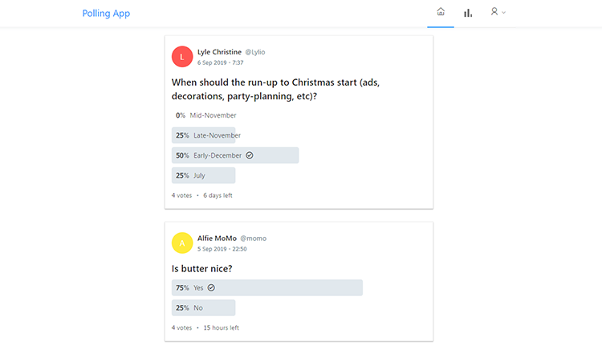

# Pollster

 
 
A Spring Boot & React polling app which includes Spring Security, JWT and MySQL. Based on the full stack tutorial at https://www.callicoder.com/series/spring-security-react/
 
 

## Database
Ensure MySQL server is installed and running on your local machine at the default http://localhost:3306. 
 Create a database named polling_app in MySQL and change the `spring.datasource.username` and `spring.datasource.password` 
properties as per your MySQL installation:

/server/src/resources/application.properties

 1. `spring.datasource.url= jdbc:mysql://localhost:3306/polling_app?useSSL=false&serverTimezone=UTC&useLegacyDatetimeCode=false`
 2. `spring.datasource.username= your-mysql-username`
 3. `spring.datasource.password= your-mysql-password`
 
 The polling_app database schema is automatically created when the server is run.

## Scripts
1. `cd scripts/`
2. `./start_server.sh`
3. Open a second terminal `./start_client`
4. Navigate to http://localhost:3000

## Server
1. `cd server/`
2. `mvnw clean install`
3. `mvnw spring-boot:run`
## Client
1. `cd client/`
2. `npm install`
3. `npm start`
## URLs
1. http://localhost:3000
